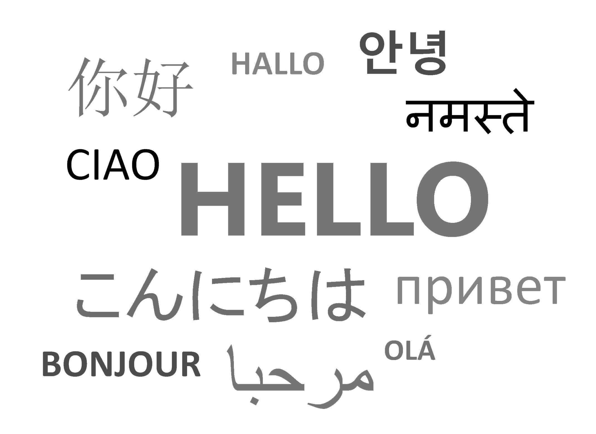

<!-- .slide vertical=true -->

## Who am I?

My name is Adrian. I'm 24 years old and currently finishing my bachelor's degree in Computer Science at Public University of Navarre (UPNA), located in Pamplona, Spain.\~

<!-- .slide -->

## Contact

- Address
  - **Universidad Pública de Navarra, Campus Arrosadía, Pamplona**
- Site
  - **<https://maizabros.github.io>**
- [Resume](https://maizabros.github.io/resume/resume.pdf)

<!-- .slide vertical=true -->

- Phone
  - **+34 663681917**
- Telegram
  - [@maizabros](https://t.me/maizabros)

- WeChat
  - Maizabros

- E-mail:
  - Personal: **[adrian.maiza@gmail.com](mailto:adrian.maiza@gmail.com)**
  - Profesional: **[maiza.115667@e.unavarra.es](mailto:maiza.115667@e.unavarra.es)**

<!-- .slide -->

## Projects

<!-- .slide vertical=true -->

* [**[Traffic Signal recognition]**](https://github.com/maizabros/TrafficSignals) --> Computer Vision course project.
* [**[Generating faces using GANs for expression recognition models]**]() --> Bachelor's thesis (WIP / Not available). 

<!-- .slide -->

## Experience

- Full stack developer at Tracasa Instrumental S.A., Sep. 2021 - Dec. 2021 (internship)

<!-- .slide -->

## Skills

<!-- .slide vertical=true -->
### Programming Languages
- **C**, Familiar
- **Java**, Familiar
- **Python**, Familiar
  - **CUDA**, Familiar&Learning
- **C#**, Familiar&Learning
- **Matlab**, Familiar&Learning

<!-- .slide vertical=true -->
### WEB
- **PHP**, Familiar&Learning
- **SQL** (MySQL, SQLServer, OracleSQL), Familiar&Learning
- **HTML**, Familiar
- **CSS**/**Bootstrap**, Familiar
- **JS/AngularJS**, Familiar

<!-- .slide vertical=true -->
### AI
* **Machine Learning**, Familiar&Learning
* **Deep Learning**, Familiar&Learning
  * **GANs**, Familiar&Learning
  * **CNNs**,**RNNs**,**ResNETs**, Familiar&Learning

<!-- .slide vertical=true -->
### Various
- **Markdown**, Familiar
- **$\LaTeX$**, Familiar
- **Shell**, **Bash**, Familiar&Learning
- **Git**, Familiar
- **VSCode**, Familiar

<!-- .slide -->

## Languages

* **Spanish**, **French**, **Basque**, Native
* **English**, B2
* **Japanese**, Basics

<!-- .slide -->

Thank you! 

I'll continue working (9｀･ω･)9

